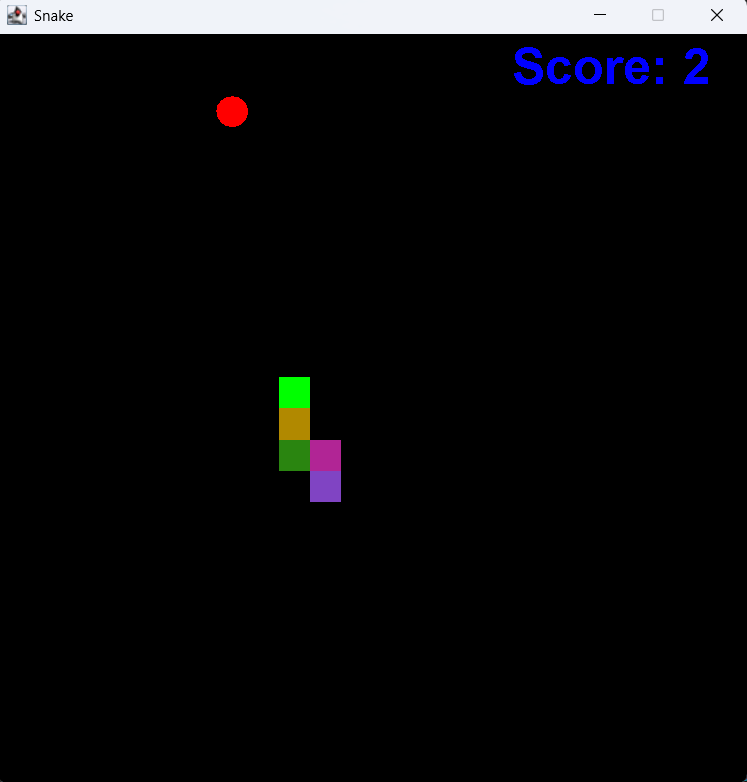

# Snake-game-using-JAVA
# Snake Game (Java Swing)

A simple Snake game implemented in Java using Swing.

## How to Run

1. **Compile all Java files:**
   ```
   javac SnakeGame.java GameFrame.java GamePanel.java
   ```

2. **Run the game:**
   ```
   java SnakeGame
   ```

## Controls

- **Arrow Keys** or **WASD**: Move the snake in the respective direction

## Files

- `SnakeGame.java` - Main class to start the game.
- `GameFrame.java` - Sets up the game window.
- `GamePanel.java` - Contains the game logic and rendering.

## Features

- Classic snake gameplay
- Randomly spawning apples
- Score display
- Game over screen

## Screenshot

**


